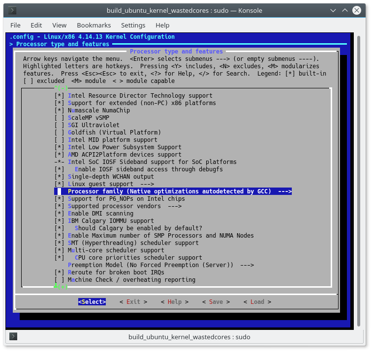

# Compile your own Ubuntu kernel easily!

## What this does:
* Allows you to customise your Ubuntu Linux kernel, without any technical knowledge.
* Downloads all the dependencies necessary to build a kernel.
* Lets you choose a Linux kernel version.
* Applies minor additional patches and performance flags for extra tuning.
* Displays a menu for you to modify the kernel.
* Builds and installs the resulting .deb package.

## Requirements:
* No real experience or knowledge of the build chain is necessary.

## How to use, simply run:
* sudo apt-get update && sudo apt-get install git
* git clone https://github.com/Turbine1991/build_ubuntu_kernel_wastedcores.git && cd build_ubuntu_kernel_wastedcores
* sudo ./clone.sh
* sudo ./menu.sh
* sudo ./build.sh

And don't forget to reboot if you install it following a successful build!

